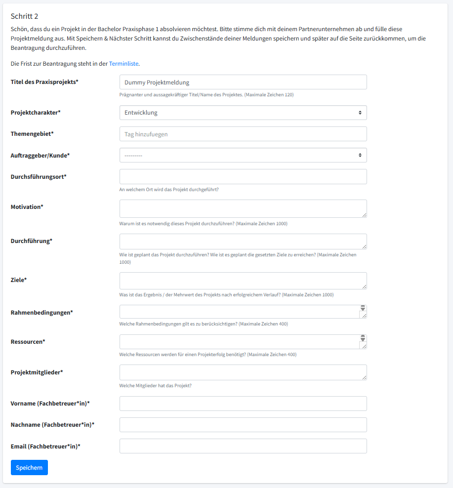

Für die ausführliche Dokumentation von Version 1, siehe hier: https://gitlab.ruv.de/XV34989/weatherangle-v1

## Inhalt

**[1. Beschreibung](#beschreibung)** 
**&nbsp;&nbsp;&nbsp;&nbsp;[1.1 Inhalt des Semesters](#inhalt-des-semesters)** 
**&nbsp;&nbsp;&nbsp;&nbsp;[1.2 Wichtige Termine](#wichtige-termine)** 
**&nbsp;&nbsp;&nbsp;&nbsp;[1.3 Lernziele Technisch](#lernziele-technisch)** 
**&nbsp;&nbsp;&nbsp;&nbsp;[1.4 Lernziele Teamarbeit](#lernziele-teamarbeit)** 
**&nbsp;&nbsp;&nbsp;&nbsp;[1.5 Beschreibung bezüglich PP1](#beschreibung-bezüglich-pp1)** 
**&nbsp;&nbsp;&nbsp;&nbsp;[1.6 Projektdefinition WeatherAngle](#projektdefinition-weatherangle)** 
**&nbsp;&nbsp;&nbsp;&nbsp;[1.7 Hausarbeit Thema](#hausarbeit-thema)** 
**[2. Anforderungen](#anforderungen)** 
**&nbsp;&nbsp;&nbsp;&nbsp;[2.1 Techstack](#techstack)** 
**&nbsp;&nbsp;&nbsp;&nbsp;[2.2 Funktionen](#funktionen)** 
**[3. Design](#design)** 
**[4. Projektstruktur](#projektstruktur)** 
**[5. Arbeitsdokumentation](#arbeitsdokumentation)** 
**[6. Ticketliste](#ticketliste)** 
**[7. Persönliche To-Dos](#persönliche-to-dos)** 

## Beschreibung

Weatherangle-v2 ist, wie der Name bereits preisgibt, die Neuaufsetzung meines ersten Angular-Übungsprojektes. Dadurch, dass WeatherAngle mein erstes eigenes Angular-Projekt war, ist der Code teilweise etwas durcheinander, schlecht verständlich oder nicht optimal strukturiert. Der Zweck des 'Rewrites' ist es das Gelernte erneut anzuwenden, um ein sauberes Projekt zu schreiben. Außerdem sollen weitere Features, wie das Einbinden eines eigenen Backends mit Login und weiteren User-Features vorbereitet werden. Eine Liste an Zielen ist unter [Lernziele](#lernziele-technisch) zu finden. Hierzu gehört unter Anderem das Verwenden einer besseren Projektstruktur, eine umfassende Nutzung von Services und das Generelle Üben vom sauberen Programmieren. WeatherAngle-v1 habe ich von GitHub auf GitLab migriert, zum Repository kommt man über [diesen Link](https://gitlab.ruv.de/XV34989/weatherangle-v1). Der bisherige Lernprozess ist dort dokumentiert.  

### Inhalt des Semesters

Das 3. Semester besteht aus 3 Modulen mit insgesamt 17,5 CP. Der Hauptbestandteil ist das 1. Praxisprojekt ('PP1') - "Arbeiten im Team" (10 CP). Die Hausarbeit zu einem aktuellen Thema der Informatik gibt 5 CreditPoints. Mehr dazu bei der dazugehörigen Sektion [hier](#hausarbeit-thema). Die restlichen 2,5 CP hängen mit dem 'Fach' Recherchieren-Schreiben-Präsentieren (kurz RSP) zusammen.

### Wichtige Termine

Teilweise noch nicht fest:
- **02.03.2026** - Projektbeantragung: Frist zur Beantragung der Projektmeldung. (Call for Project).
- **30.03 - 02.04.2026** - Recherchieren-Schreiben-Präsentieren
- **13.04.2026 16:00 Uhr** - Kickoff Tag 1
- **20.04.2026 08:00** - Kickoff Tag 2
- **09.07.2026** - Abgabe Exposé
- **23.07.2026** - Reflexion
- **25.08.2026** - Workshop
- **11.09.2026** - Abgabe Hausarbeit
- **18.09.2026** - Präsentation & Fachgespräch

### Lernziele Technisch

Teilweise aus v1 übernommen. Parallelen zu Fächern aus dem Studium wurden notiert.

#### Sinnvolle Projektstruktur
Ziel ist es im Vorhinein einen guten Überblick über die Applikation zu haben, um eine sinnvolle Projektstruktur planen zu können. Mehr dazu unter [Projektstruktur](#projektstruktur)
#### Dokumentation
Auch wenn ich diesbezüglich gutes Feedback bekommen habe möchte ich, gerade in Hinsicht auf die Bewertung, trotzdem dieses Ziel notieren. Alle großen Entscheídungen und Lerneffekte sollten in der README oder unter `/docs` dokumentiert werden. Falls OpenAPI für das Backend benutzt wird, sollte `@Schema` mindestens mit `description` und `example` beschrieben werden.
#### Guards
Der abgeschlossene Bereich sollte mit einem Guard geschützt werden, anstatt nur über bedingte Anzeigen (`*ngIf`) zu arbeiten. Guards prüfen die Berechtigung bereits beim Routing und verhindern so das Laden der Komponente für unautorisierte Nutzer. Das kann die Sicherheit, sowie Performance erhöhen. Außerdem macht die Umsetzung über Guards das Programm potenziell übersichtlicher.
#### Url Manipulation
Die Implementierung in v1 verwendet `window.location.href` für die Navigation, was nicht den Angular Best Practices entspricht. Stattdessen sollte der Angular Router verwendet werden, um eine bessere Integration mit dem Framework zu erreichen. Dies würde auch die Verwendung von Route-Parametern, URL-Query-Parametern und State Management ermöglichen, was die Anwendung robuster und wartbarer machen würde.
#### Observables
Die bisherige Implementierung in v1 verwendet ausschließlich Promises für asynchrone Operationen. Angular basiert jedoch stark auf dem Observable-Pattern, das mehr Flexibilität und Kontrolle über Datenströme bietet. Observables ermöglichen das Abonnieren von Datenänderungen, das Filtern und Transformieren von Daten sowie die Möglichkeit, Datenströme zu kombinieren. Dies ist besonders nützlich für Features wie Auto-Complete in der Suchleiste oder Live-Updates der Wetterdaten. Das Prinzip von Observern haben wir bereits in **OOAD** (_mittlerweile SC genannt_) im 2. Semester behandelt.
#### Reactive Forms
Die aktuelle Implementierung in v1 verwendet Template-Driven Forms mit `ngModel` für Formulare wie das Login-Modal. Diese Herangehensweise macht es schwerer, Formularlogik zu testen und bietet weniger Kontrolle über Validierung und Fehlerbehandlung. Reactive Forms würden eine übersichtlichere Alternative bieten und eine zentralisierte Verwaltung des Formular-Zustands ermöglichen.
#### Kommentare
HTML-Kommentare sollten vermieden werden, da sie im Browser sichtbar sind, was potenzielle Sicherheitsrisiken bergen kann. Stattdessen sollte die Dokumentation von Code-Logik in TypeScript-Dateien oder separater Dokumentation erfolgen. <!-- https://stackoverflow.com/a/35235768/16805423 --> Auch hier können Konzepte/Regeln aus OOAD/SC angewendet werden.
#### Verwendung von document & window
Die direkte Manipulation des DOM über document.querySelector und der Zugriff auf das window-Objekt sollten in Angular vermieden werden. Stattdessen sollten Angular-spezifische Mechanismen wie `@ViewChild`, `ElementRef` und der Angular Router verwendet werden. Die direkte DOM-Manipulation kann zu XSS-Sicherheitslücken führen, ist schwerer zu testen und umgeht Angulars Change Detection. Zudem kann die Verwendung von window Probleme bei Server-Side-Rendering verursachen.
#### Copyright
In v1 wurde jegliche Nutzung von geschützten Daten mit Beachtung der Lizenz erwähnt. [OpenMeteo](https://open-meteo.com/) benutzt zum Beispiel die Lizenzart [Attribution 4.0 International](https://creativecommons.org/licenses/by/4.0/), die auch kommerzielle Nutzung erlaubt, soweit eine [angemessene Quellenangabe](https://wiki.creativecommons.org/wiki/License_Versions#Detailed_attribution_comparison_chart) vorhanden ist. Diese Regeln sollten unbedingt befolgt und dokumentiert werden. Andere Beispiele hierfür waren die Hintergrundbilder, Nominatim oder Google Icons.
#### Tests
Alle Funktionen sollten durch Tests abgedeckt sein. Hierfür werde ich die in RVS eingesetzten Tools benutzen um mich mit diesen weiter vertraut zu machen. Hierzu zählen Unit-Tests via Jasmine und Karma und UI basierte Tests mit Cypress.

### Lernziele Teamarbeit

#### Einbringen ins Team
Ich sollte/will mich nicht nur fachlich, sondern auch sozial ins Team einbringen, indem ich proaktiv Feedback einhole, bei Fragen oder Problemen bereit bin diese zu stellen und bei Teamveranstaltungen mich beteilige. Die 'blaue Firmenkultur' sollte beachtet werden.
#### Arbeiten im Team
Ich werde mich während des Praxisprojektes, auch wenn ich an meinem eigenen Projekt, wie die anderen Entwickler im Team arbeiten. Ich werde weiterhin bei Sprint Planungen, Retros, Dailys und PI Plannings dabei sein und mich einbringen. Alle Aufgaben werden in Tickets dokumentiert und in Dailies besprochen und in Sprint Planungen & Retros aufgeplant.
#### Fachliches Arbeiten
Ich habe mich bereits während der letzten Praxisphase mit fachlichen Tickets beschäftigt. Falls ich mich während des Praxisprojektes mit fachlichen Themen befasse, werde ich das transparent dokumentieren, wobei ich auf einhalten der Firmengeheimnisse achte.

### Beschreibung bezüglich PP1

**Lernziel**: In der ersten Praxisphase sollen die Studierenden vor allem Teamarbeit und Zusammenarbeit in Projekten erlernen und praktisch erfahren. Sie werden im Partnerunternehmen in ein Projektteam integriert, um die in den ersten beiden Semestern erworbenen Informatik- Grundlagen im realen Betrieb anzuwenden und zu vertiefen. Dabei geht es insbesondere darum, über das fachliche hinweg, auch die "überfachlichen" Kompetenzen der Kooperation im Team zu lernen. Die Studierenden lernen, IT- Projekte strukturiert anzugehen, einen Projektplan mit Zielen, Meilensteinen und Zeitplänen zu erstellen und Projektrisiken abzuschätzen. Zudem sollen sie ihre technischen Kenntnisse in einem konkreten Projektumfeld erweitern und "Soft Skills" wie Kommunikations- und Präsentationstechnik, Team- und Problemlösungsfähigkeit trainieren.

**Thema/Projekt**: Die Themenwahl ist relativ frei, sollte jedoch so gewählt sein, dass man es inhaltlich im Begleitmodul „Hausarbeit zu einem aktuellen Thema der Informatik“ behandeln bzw. vertiefen kann. Das kann die Bearbeitung zumindest vereinfachen.

h_da macht Zuteilung, Prof kann jedoch Wunschthemen auswählen.

#### Wie werden die Anforderungen durch WeatherAngle erfüllt?

Vorab wichtig: Ziel des Repositories ist nicht nur eine Kopie oder ein "Rewrite" sondern eine Weiterentwicklung mit sauberem Code als Basis. Es handelt sich um eine substanzielle Weiterentwicklung mit neuen Zielen und Verbesserungen. 

## Projektdefinition WeatherAngle

[Prozessübersicht - Meldung eines Praxisprojektes](https://managi.infdl.fbi.h-da.de/infdl/practicephase/project/call/mYffL0E6rNbMgtBCjdv73LmQS2ETuzk6SeykRhw4qdzaveI3Sj2xWpIbklON5GhqCCGArKqsXtfAH0bAg6w4ZCwwRQVJpizk8XiD)

### Titel des Praxisprojekts

WeatherAngle

### Projektcharakter

 - [x] Entwicklung
 - [ ] Konzeption
 - [ ] Innovation
 - [ ] Forschung
 - [ ] Sonstiges

### Themengebiet

_Auch 'Tag' oder 'Buzzword' genannt_

Webentwicklung mit Angular(?)

### Auftraggeber/Kunde

 - [ ] intern
 - [ ] extern

### Durchführungsort

R+V Wiesbaden

### Motivation

_Warum ist es notwendig dieses Projekt durchzuführen? (Maximale Zeichen 1000)_

### Durchführung

_Wie ist geplant das Projekt durchzuführen? Wie ist es geplant die gesetzten Ziele zu erreichen? (Maximale Zeichen 1000)_

### Ziele

_Was ist das Ergebnis / der Mehrwert des Projekts nach erfolgreichem Verlauf? (Maximale Zeichen 1000)_

### Rahmenbedingungen

_Welche Rahmenbedingungen gilt es zu berücksichtigen? (Maximale Zeichen 400)_

### Ressourcen

_Welche Ressourcen werden für einen Projekterfolg benötigt? (Maximale Zeichen 400)_

### Projektmitglieder

_Welche Mitglieder hat das Projekt?_

### Name & Email Fachbetreuer*in

Christoph Schuppler, [christoph.schuppler@ruv.de](mailto:christoph.schuppler@ruv.de)

## Hausarbeit Thema

_Notizen_

Arbeiten MIT KI
 - Wie weit würde KI mit meiner Dokumentation kommen?
 - Einmal mit Angular, einmal ohne Angular
 - Oneshot vs. Guided
 - KI in der R+V: KI-Portal, In-IDE-KI
 - Interviews?
 - Auch hier: Datenschutz, warum so zögerlich? Meiner Meinung nach gut
 - Zukunftsfähigkeit 

Wie hilft KI bei Wettervorhersagen?
 - Entwicklung in den letzten 20 Jahren (z. B.)
 - Was für Daten benötigt die KI für die Vorhersage? 
 - Wie wurde sie trainiert?
 - Wie akkurat sind die Vorhersagen?
 - Wird die KI eingesetzt und wenn ja von wem?
 - Viele Möglichkeiten, auch für Interviews etc.

ChatBot Wettervorhersage
 - Ein ChatBot kriegt Daten wie Standort, favorisierte Orte, Uhrzeit, Wettervorhersagen, Anweisungen des Users und einen Einblick in den Terminkalender
 - Außerdem kriegt er die Möglichkeit auf APIs zuzugreifen, wie Navi/Maps, aktuelle Events via Google Maps oder Tripadvisor
 - Interessante Hausarbeitsthemen wären hierbei Agentic AI Agents 

## Anforderungen

Was möchte ich am Ende des Projektes erreicht haben bezüglich der Funktionen von WeatherAngle? 

### Techstack

Ziel ist es den gleichen Techstack wie das Team zu verwenden um sich bestmöglich einzuarbeiten.

#### Frontend

Angular mit ng-bootstrap, SASS und Jasmine + Karma zum testen. Zudem Gherkin Testfälle.

#### Backend

Spring-Boot, JPA, Flyway(?), H2 zum lokalen Development

#### Deployment?

Bisher nur privat gehostet auf eigenem VPS und eigener Domain. Vielleicht intern? Pipelines etc. Sonar, usw.

### Funktionen

_Was soll WeatherAngle am Ende können?_

## Design

## Projektstruktur

## Arbeitsdokumentation

_Dokumentation über Zeit hier_

## Ticketliste

Filter-Links: [LucaWeatherAngle](https://jira.ruv.de/projects/KXKFZRVS?selectedItem=com.almworks.jira.structure:wi-projectnav-structure&s=%7B%22sQuery%22%3A%7B%22query%22%3A%22labels%20%3D%20%5C%22LucaWeatherAngle%5C%22%22%2C%22type%22%3A%22jql%22%7D%7D#) | [xv34989](https://jira.ruv.de/projects/KXKFZRVS?selectedItem=com.almworks.jira.structure:wi-projectnav-structure&s=%7B%22sQuery%22%3A%7B%22query%22%3A%22assignee%20%3D%20XV34989%22%2C%22type%22%3A%22jql%22%7D%7D#)

- [ ] [KXKFZRVS-1220](https://jira.ruv.de/browse/KXKFZRVS-1220): Ausbildung Luca: Wiederaufbau EU für RVS - [Altes Ticket](https://jira.ruv.de/browse/KXKFZRVS-572)
- [ ] [KXKFZRVS-283](https://jira.ruv.de/browse/KXKFZRVS-283): Ausbildung Luca: Entwicklung Frontend m. Schnittstelle
- [ ] [KXKFZRVS-291](https://jira.ruv.de/browse/KXKFZRVS-291): Ausbildung Luca: Entwicklung Backend
- [ ] [KXKFZRVS-292](https://jira.ruv.de/browse/KXKFZRVS-292): Ausbildung Luca: Unittests für Frontend
- [ ] [KXKFZRVS-576](https://jira.ruv.de/browse/KXKFZRVS-576): Ausbildung Luca: Einarbeitung ng-bootstrap
- [ ] [KXKFZRVS-577](https://jira.ruv.de/browse/KXKFZRVS-577): Ausbildung Luca: Aufbau abgeschlossener Bereich (im Frontend)
- [ ] [KXKFZRVS-744](https://jira.ruv.de/browse/KXKFZRVS-744): Ausbildung Luca: Unittests für Backend
- [ ] [KXKFZRVS-749](https://jira.ruv.de/browse/KXKFZRVS-749): Ausbildung Luca: Umsetzung Login via Backend
- [ ] [KXKFZRVS-881](https://jira.ruv.de/browse/KXKFZRVS-881): Ausbildung Luca: Konzeption Login via Backend
- [ ] [KXKFZRVS-882](https://jira.ruv.de/browse/KXKFZRVS-882): Ausbildung Luca: Umsetzung Registrierung
- [ ] [KXKFZRVS-883](https://jira.ruv.de/browse/KXKFZRVS-883): Ausbildung Luca: Passwort vergessen Funktion
- [ ] [KXKFZRVS-934](https://jira.ruv.de/browse/KXKFZRVS-934): Umfassendes Refactoring der Wetterapp
- [ ] [KXKFZRVS-1217](https://jira.ruv.de/browse/KXKFZRVS-1217): Ausbildung Luca: Analyse für Praxisphase und Vorstellen aller Eckdaten

## Persönliche To-Dos

_Eine Liste nur für mich zum notieren von Aufgaben, Ideen, usw._

 - Ausformulieren von Ideen für Hausarbeit
 - Ausarbeiten von TechStack Sektion, nicht nur die Stichpunkte. Kurz erklären was die Tools/Frameworks machen und was für einen Vorteil sie haben.
 - Lernziel in einem Satz relativ am Anfang
