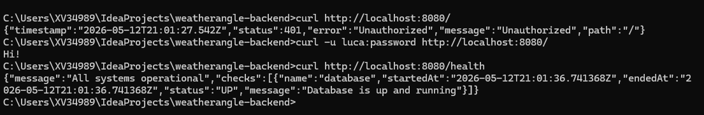

```shell
C:\Users\XV34989\IdeaProjects\weatherangle-backend>curl http://localhost:8080/
{"timestamp":"2026-05-12T21:01:27.542Z","status":401,"error":"Unauthorized","message":"Unauthorized","path":"/"}
C:\Users\XV34989\IdeaProjects\weatherangle-backend>curl -u luca:password http://localhost:8080/
Hi!
C:\Users\XV34989\IdeaProjects\weatherangle-backend>curl http://localhost:8080/health
{"message":"All systems operational","checks":[{"name":"database","startedAt":"2026-05-12T21:01:36.741368Z","endedAt":"2026-05-12T21:01:36.741368Z","status":"UP","message":"Database is up and running"}]}
C:\Users\XV34989\IdeaProjects\weatherangle-backend>
```